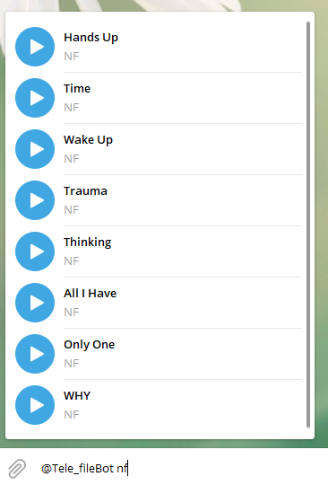

# songs.inc
songs.inc is a large collection of songs scrapped from telegram. You can search any song by name or arist.
You can also share your tracks and support the database. 

[Songs.inc](https://t.me/Tele_fileBot)

It uses approximate string matching, so don't worry about typos :) 

## Install
1. download project 
2. run `pip install -r requirements`

## Usage
`python bot.py -t <TOKEN> -i <api_id> -q <api_hash>` to start bot 

### bot in action, doing inline search

